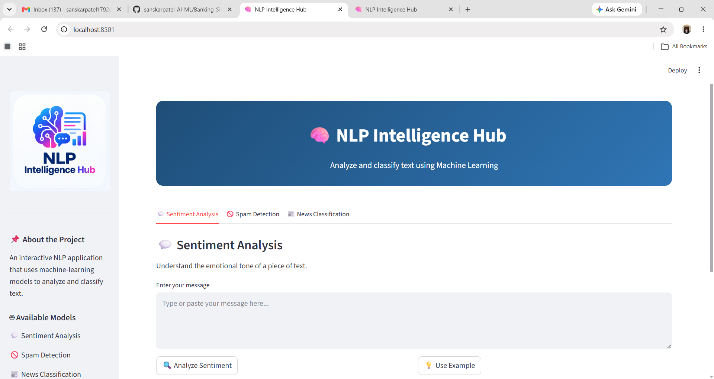
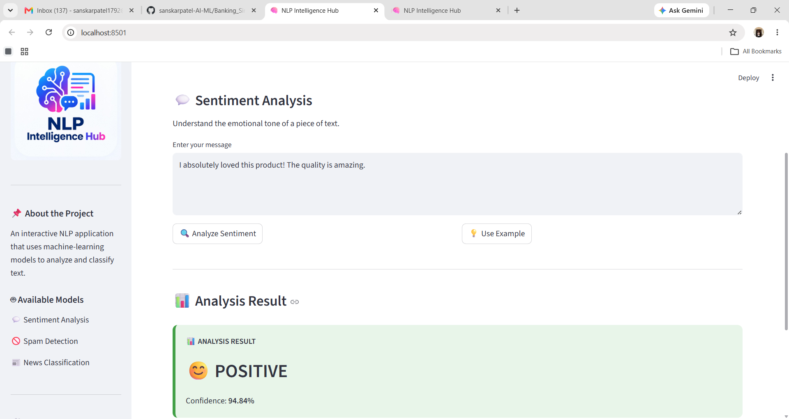
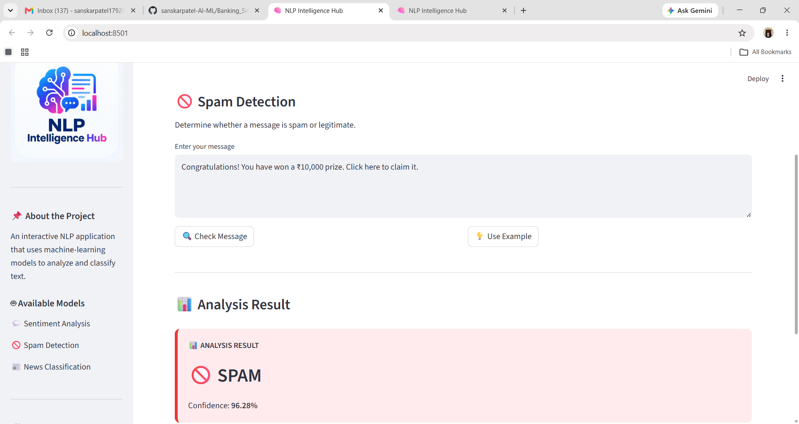
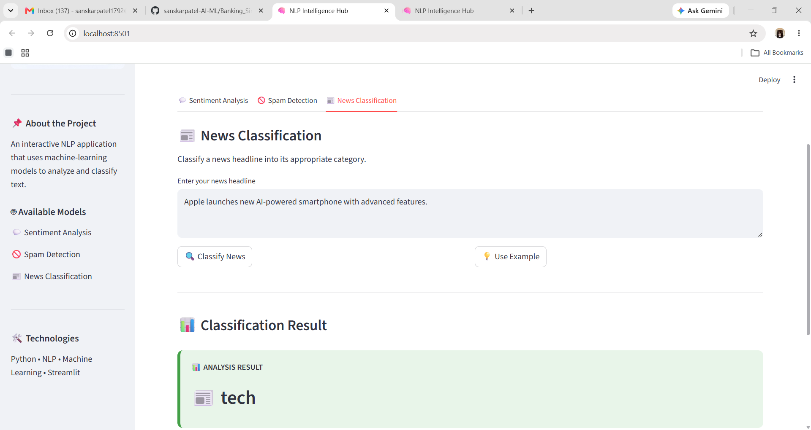

# 🧠 NLP Intelligence Hub

An interactive Natural Language Processing (NLP) application built using Python, Machine Learning, and Streamlit.

The application brings three NLP classification projects together in a single user-friendly interface.

## 🚀 Features

### 😊 Sentiment Analysis
Classifies text as:
- Positive
- Negative

The application also displays the model's confidence score.

### 🛡️ Spam Detection
Classifies a message as:
- Spam
- Ham

The application displays the prediction along with its confidence score.

### 📰 News Classification
Classifies a news article into its corresponding category using a trained machine learning model.

## 🛠️ Technologies Used

- Python
- Machine Learning
- Natural Language Processing (NLP)
- Scikit-learn
- Streamlit
- Joblib

## 📁 Project Structure

```text
NLP_Intelligence_Hub/
│
├── nlp_intelligence_hub.py
├── NLP_image.png
├── requirements.txt
│
├── sentiment_model.pkl
├── sentiment_vectorizer.pkl
│
├── spam_model.pkl
├── spam_vectorizer.pkl
│
├── news_model.pkl
└── news_vectorizer.pkl
```


## ⚙️ How to Run
1. Clone or download the project

Open the project folder in VS Code.

2. Install the required packages

Open the terminal inside the project folder and run:

pip install -r requirements.txt

3. Run the Streamlit application
streamlit run nlp_intelligence_hub.py

The application will open in your web browser.

## 💡 How to Use

Select one of the available NLP tasks.
Enter text into the input box.
Click the analysis button.
View the prediction and confidence score where available.
Use the example button to quickly test the application.

## 🎯 Project Objective

The objective of this project is to combine multiple NLP classification applications into a single interactive Streamlit dashboard and demonstrate the practical use of machine learning for text classification.

## 📸 Screenshots

### 🏠 Application Interface



### 😊 Sentiment Analysis



### 🚨 Spam Detection



### 📰 News Classification



## 👨‍💻 Author

Sanskar Patel

Python • Machine Learning • NLP • Streamlit

© 2026 Sanskar Patel